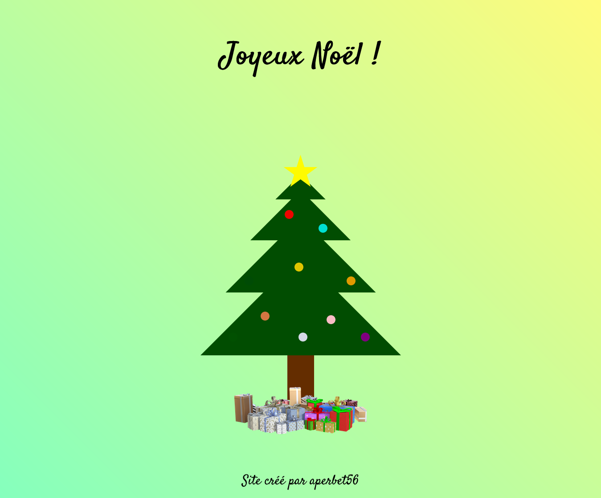

## MON SAPIN DE NOEL 🎄

## Le challenge

Création d'un sapin de Noël en HTML5 et CSS3 avec boule de Noël qui clignottent.

## Démonstration

Lien vers le projet : https://aperbet56.github.io/sapin_de_noel/

## Projet développé avec

- Utilisation des balises sémantiques HTML5
- CSS
- Flexbox
- Animations CSS
- Importation de la police Satisfy
- Utilsation d'un normaliseur : le fichier normalize.css
- Page web responsive
- Desktop first
